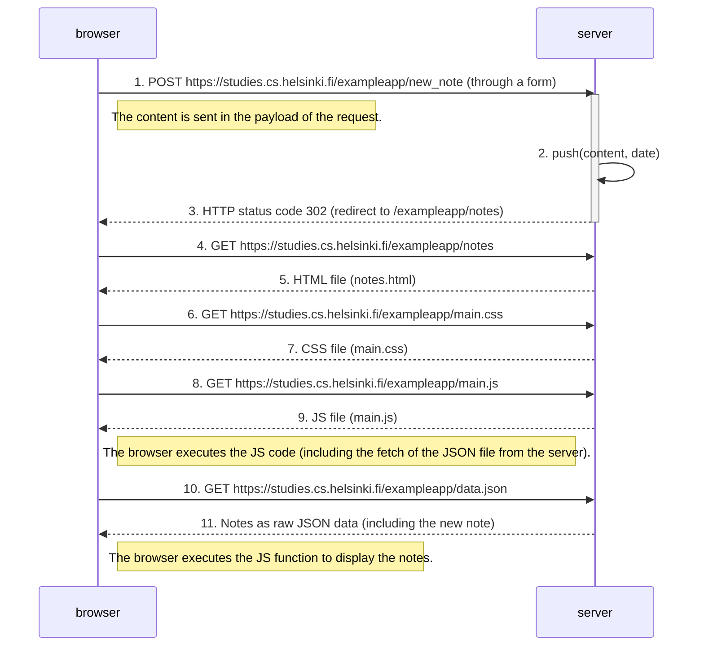

```mermaid
sequenceDiagram
    participant browser
    participant server

    browser->>server: 1. POST https://studies.cs.helsinki.fi/exampleapp/new_note (through a form)

    activate server
        Note right of browser: The content is sent in the payload of the request.
    
        server->>server: 2. push(content, date)
    
        server-->>browser: 3. HTTP status code 302 (redirect to /exampleapp/notes)
    deactivate server

    browser->>server: 4. GET https://studies.cs.helsinki.fi/exampleapp/notes
    
    server-->>browser: 5. HTML file (notes.html)

    browser->>server: 6. GET https://studies.cs.helsinki.fi/exampleapp/main.css

    server-->>browser: 7. CSS file (main.css)

    browser->>server: 8. GET https://studies.cs.helsinki.fi/exampleapp/main.js

    server-->>browser: 9. JS file (main.js)

    Note right of browser: The browser executes the JS code (including the fetch of the JSON file from the server).

    browser->>server: 10. GET https://studies.cs.helsinki.fi/exampleapp/data.json

    server-->>browser: 11. Notes as raw JSON data (including the new note)

    Note right of browser: The browser executes the JS function to display the notes.
```
