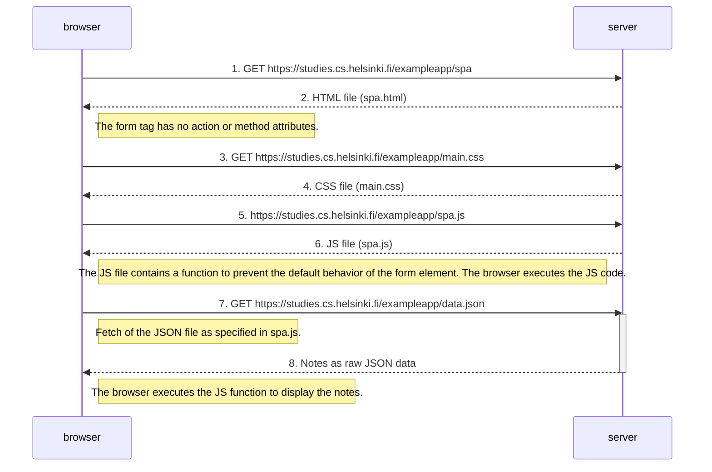

```mermaid
sequenceDiagram
    participant browser
    participant server

    browser->>server: 1. GET https://studies.cs.helsinki.fi/exampleapp/spa

    server-->>browser: 2. HTML file (spa.html)

    Note right of browser: The form tag has no action or method attributes.

    browser->>server: 3. GET https://studies.cs.helsinki.fi/exampleapp/main.css

    server-->>browser: 4. CSS file (main.css)

    browser->>server: 5. https://studies.cs.helsinki.fi/exampleapp/spa.js

    server-->>browser: 6. JS file (spa.js)

    Note right of browser: The JS file contains a function to prevent the default behavior of the form element. The browser executes the JS code.

    browser->>server: 7. GET https://studies.cs.helsinki.fi/exampleapp/data.json

    activate server
        Note right of browser: Fetch of the JSON file as specified in spa.js.

        server-->>browser: 8. Notes as raw JSON data
    deactivate server

    Note right of browser: The browser executes the JS function to display the notes.
```
