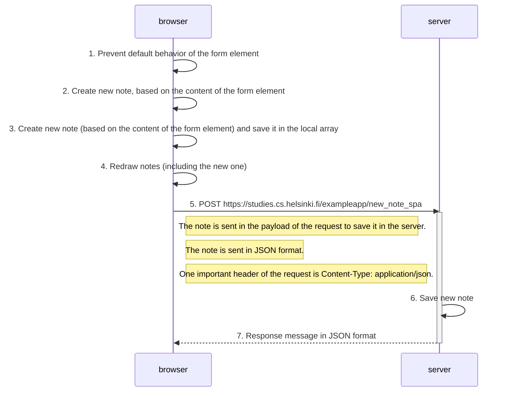

```mermaid
sequenceDiagram
    participant browser
    participant server

    browser->>browser: 1. Prevent default behavior of the form element

    browser->>browser: 2. Create new note, based on the content of the form element

    browser->>browser: 3. Create new note (based on the content of the form element) and save it in the local array

    browser->>browser: 4. Redraw notes (including the new one)

    browser->>server: 5. POST https://studies.cs.helsinki.fi/exampleapp/new_note_spa

    activate server
        Note right of browser: The note is sent in the payload of the request to save it in the server.

        Note right of browser: The note is sent in JSON format.

        Note right of browser: One important header of the request is Content-Type: application/json.

        server->>server: 6. Save new note

        server-->>browser: 7. Response message in JSON format
    deactivate server
```
